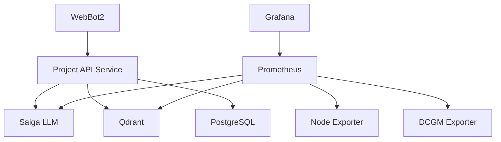

# ML Infrastructure - Main Documentation
*Version 1.3 от 12.12.2024*

## Содержание документации

### Основная документация [Диалоговый Агент]
1. [Общая архитектура](#общая-архитектура)
2. [Взаимодействие сервисов](#взаимодействие-сервисов)
3. [Сетевая инфраструктура](#сетевая-инфраструктура)
4. [Основные компоненты](#основные-компоненты)

### Дополнительная документация
- [Technical Specifications](ml-infrastructure-tech-specs12122024.md) - технические спецификации, библиотеки и зависимости
- [Services Guide](ml-infrastructure-services12122024.md) - руководство по работе с сервисами
- [Monitoring & Resources](ml-infrastructure-monitoring12122024.md) - мониторинг и управление ресурсами
- [Backup & Recovery](ml-infrastructure-backup12122024.md) - резервное копирование и восстановление

## Общая архитектура

### Аппаратная конфигурация
- **CPU**: AMD Threadripper PRO 5975WX (32 ядра)
- **RAM**: 128 GB
- **Storage**: 1.5T NVMe SSD
- **GPU**: NVIDIA GeForce RTX 4090 (24GB VRAM)
  - CUDA Version: 12.6
  - Driver Version: 560.35.03
  - Total Memory: 24564MiB

### Основные сервисы и порты
| Сервис | Порт(ы) | Описание |
|--------|----------|-----------|
| Saiga LLM | your_port | LLM модель |
| Qdrant New | your_port | Векторная база данных |
| PostgreSQL | your_port | База данных |
| Grafana | your_port | Визуализация метрик |
| Prometheus | your_port | Сбор метрик |
| WebBot2 | your_port | Веб-интерфейс |
| Project API | your_port | API сервис |

## Взаимодействие сервисов

### Сетевая структура


### Потоки данных
1. **Запрос пользователя**
   ```
   WebBot2 → Project API → RAG System:
   - Поиск в Qdrant
   - Обработка Saiga LLM
   - Сохранение в PostgreSQL
   ```

2. **Мониторинг**
   ```
   Grafana ← Prometheus ← [
     Saiga метрики
     Qdrant метрики
     System метрики
     GPU метрики
   ]
   ```

## Сетевая инфраструктура

### Сеть mlopsnew (172.22.0.0/16)
```yaml
grafana_new:      172.22.0.5
prometheus_new:   172.22.0.3
qdrant_new:       172.22.0.7
saiga_saiga_1:    172.22.0.9
project_api:      172.22.0.10
agent_exporter:   172.22.0.2
node-exporter:    172.22.0.4
dcgm-exporter:    172.22.0.6
```

### Сеть agent_default (172.20.0.0/16)
```yaml
project_api:      172.20.0.2
webbot2:         172.20.0.3
ml_postgres:     172.20.0.4
agent_exporter:  172.20.0.5
qdrant:          172.20.0.6
prometheus_new:  172.20.0.7
```

## Основные компоненты

### Saiga LLM
- **Модель**: NightForger/saiga_nemo_12b-GPTQ
- **Конфигурация**:
  ```yaml
  max_model_len: 20000
  temperature: 0.7
  top_p: 0.9
  presence_penalty: 0.0
  frequency_penalty: 0.0
  max_tokens: 1024
  ```
- **Метрики**:
  - Throughput (tokens/s)
  - GPU usage
  - Response time
  - Error rate

### Qdrant Vector DB
- **Коллекции**:
  - BD_curs_data
  - BD_chat_question
  - BD_organization_question
- **Конфигурация**:
  ```yaml
  storage:
    storage_path: /qdrant/storage
  service:
    http_port: 6333
    grpc_port: 6334
  ```

### PostgreSQL
- **Version**: 15
- **Database**: ml_db
- **Performance Settings**:
  ```ini
  max_connections = 100
  shared_buffers = 256MB
  work_mem = 16MB
  maintenance_work_mem = 128MB
  wal_buffers = 16MB
  min_wal_size = 1GB
  max_wal_size = 4GB
  ```

### Project API Service
- FastAPI application
- Endpoints:
  - /process_message
- Features:
  - Streaming responses
  - Error handling
  - Metrics collection

### Monitoring Stack
- Grafana dashboards
  - System & GPU Overview
  - Saiga Metrics
  - Qdrant Performance
- Prometheus collectors
  - Node metrics
  - GPU metrics
  - Application metrics