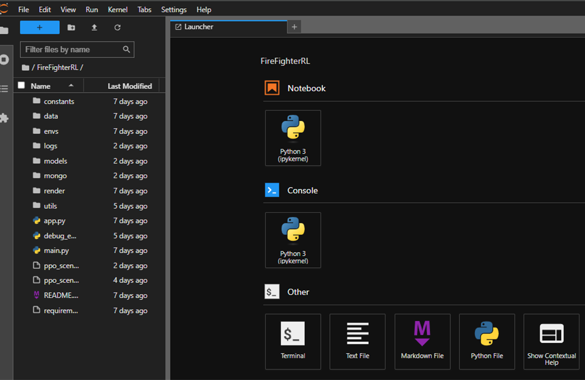
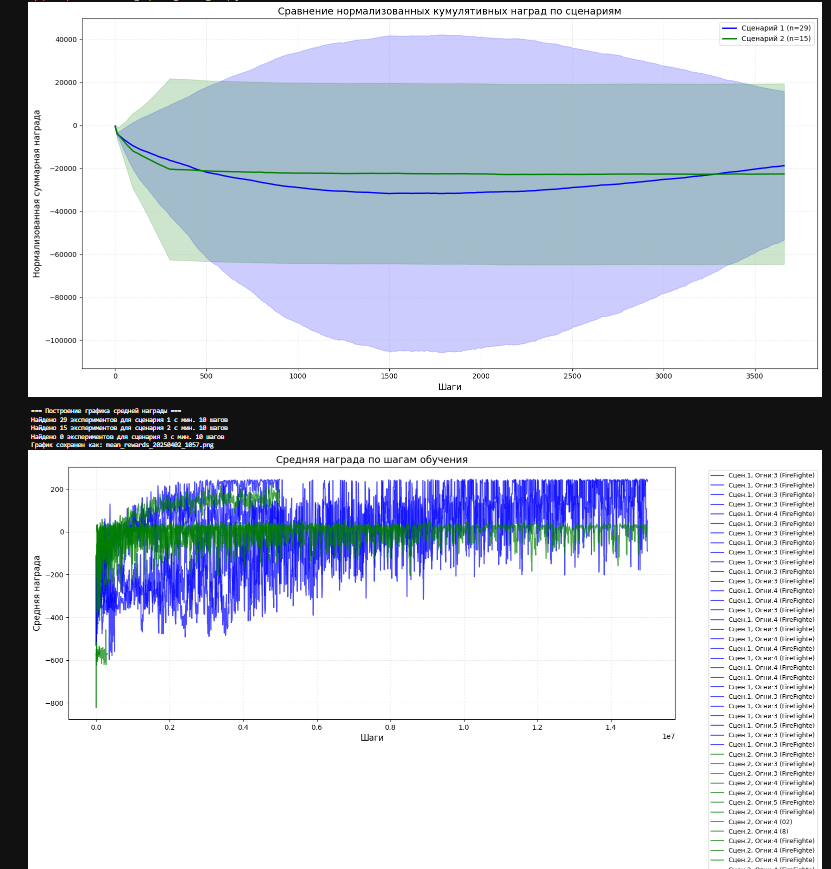

- [Описание проекта FireFighterRL](README.md)
- [Руководство по развертыванию FireFighter ML-инфраструктуры](firetechinstallguide.md)
- [Руководство по системе резервного копирования](backupinstallguide.md)

**ОПИСАНИЕ АРХИТЕКТУРЫ**

«JupyterHub с Docker: NativeAuthenticator для проекта FireTech»

**2025**

**ВВЕДЕНИЕ**

Инфраструктура проекта имеет микросервисную архитектуру на основе Docker-контейнеров. Она состоит из среды разработки JupyterHub, базы данных MongoDB, системы мониторинга и системы резервного копирования. Инфраструктура разработана специально для проекта FireTech, который использует методы обучения с подкреплением для координации дронов при тушении пожаров.

Пользователь взаимодействует с системой через web-браузер посредством HTTP. Администратор получает расширенные возможности управления пользователями и системой через панель администратора JupyterHub.

**ОПИСАНИЕ СТРУКТУРЫ**

Структура системы представлена на основе микросервисов с использованием Docker Compose для оркестрации контейнеров и управления сервисами.

Программное обеспечение (далее -- ПО) в составе инфраструктуры можно разделить на несколько функциональных блоков. Вся система организована в Docker-контейнеры, управляемые через Docker Compose. Перечень ПО представлен в таблице 1.

Таблица 1 -- Перечень ПО инфраструктуры

| **№** | **Приложение** | **Место установки** | **Описание** |
|-------|----------------|---------------------|--------------|
| **Системные приложения** |  |  |  |
| 1. | Docker Engine | Сервер | Основная платформа контейнеризации, используемая для запуска всех компонентов системы |
| 2. | Docker Compose | Сервер | Инструмент для определения и запуска многоконтейнерных приложений Docker |
| 3. | Nvidia-smi | Сервер | Утилита для мониторинга и управления NVIDIA GPU, включая мониторинг состояния, загрузки и памяти |
| 4. | Nvidia-container-toolkit | Сервер | Инструмент для интеграции NVIDIA GPU с контейнерами, обеспечивающий доступ к GPU внутри контейнеров |
| **Блок разработки** |  |  |  |
| 5. | JupyterHub | Docker | Центральный компонент системы, управляющий аутентификацией, авторизацией и запуском пользовательских серверов |
| 6. | DockerSpawner | Docker | Компонент JupyterHub, создающий контейнеры для пользовательских сессий и управляющий их жизненным циклом |
| 7. | NativeAuthenticator | Docker | Компонент JupyterHub, обеспечивающий регистрацию новых пользователей и их одобрение администратором |
| 8. | Jupyter Notebook | Docker | Интерактивная среда разработки для создания и редактирования кода, установленная в пользовательских контейнерах |
| **Блок баз данных** |  |  |  |
| 9. | MongoDB | Docker | База данных для хранения метрик обучения, результатов экспериментов и пользовательских данных |
| 10. | SQLite | Docker | Легковесная БД для хранения данных JupyterHub (пользователи, сессии) |
| **Блок мониторинга** |  |  |  |
| 11. | Prometheus | Docker | Система мониторинга с открытым исходным кодом для сбора, хранения и анализа метрик |
| 12. | Grafana | Docker | Инструмент для визуализации метрик и создания дашбордов |
| 13. | Node Exporter | Docker | Экспортер системных метрик для Prometheus |
| 14. | CAdvisor | Docker | Экспортер метрик контейнеров |
| 15. | Nvidia-smi-exporter | Docker | Экспортер метрик NVIDIA GPU |
| 16. | AlertManager | Docker | Система оповещений для Prometheus |
| 17. | Loki | Docker | Система сбора и хранения логов |
| 18. | Promtail | Docker | Агент для сбора логов и отправки их в Loki |
| **Блок резервирования** |  |  |  |
| 19. | Backup Script | Сервер | Скрипт для создания резервных копий данных, их шифрования и отправки в хранилище |
| 20. | Restore Script | Сервер | Скрипт для восстановления данных из резервных копий |
| 21. | rclone | Сервер | Утилита для синхронизации файлов с облачными хранилищами |
| **Библиотеки для ML** |  |  |  |
| 22. | Gymnasium | Docker (Notebook) | Фреймворк для разработки и сравнения алгоритмов обучения с подкреплением |
| 23. | Stable-Baselines3 | Docker (Notebook) | Набор улучшенных реализаций алгоритмов обучения с подкреплением |
| 24. | PyTorch | Docker (Notebook) | Библиотека машинного обучения с поддержкой GPU |
| 25. | TensorFlow | Docker (Notebook) | Библиотека машинного обучения с поддержкой GPU |
| 26. | Optuna | Docker (Notebook) | Фреймворк для автоматизации оптимизации гиперпараметров |

## Описание компонентов JupyterHub и их взаимодействия

JupyterHub состоит из следующих основных компонентов:

1. **JupyterHub Сервер**: Центральный компонент системы, управляющий аутентификацией, авторизацией и запуском пользовательских серверов. Работает в отдельном контейнере, координирует запуск пользовательских серверов.

2. **Docker Spawner**: Компонент JupyterHub, отвечающий за создание и управление контейнерами пользователей. Для каждого пользователя создаётся отдельный Docker-контейнер, что обеспечивает изоляцию пользователей.

3. **NativeAuthenticator**: Компонент JupyterHub, обеспечивающий аутентификацию пользователей. Предоставляет возможность регистрации новых пользователей и их одобрение администратором системы.

4. **Персистентное хранилище**: Docker тома для хранения пользовательских данных и SQLite база данных для JupyterHub. Обеспечивает сохранность данных между перезапусками контейнеров.

Взаимодействие компонентов происходит следующим образом:
- Пользователь авторизуется через NativeAuthenticator
- JupyterHub Сервер запрашивает у Docker Spawner создание контейнера для пользователя
- Docker Spawner создаёт и запускает контейнер на основе образа `my-custom-jupyter-notebook`
- JupyterHub перенаправляет пользователя в его персональный Jupyter Notebook
- Пользовательские данные сохраняются в Docker томе, связанном с конкретным пользователем

## Блок мониторинга

Система мониторинга состоит из следующих компонентов:

1. **Prometheus**: Центральный компонент мониторинга, собирает и хранит метрики от всех экспортеров.

2. **Экспортеры**: 
   - Node Exporter: сбор системных метрик
   - CAdvisor: метрики Docker-контейнеров
   - Nvidia-smi-exporter: метрики GPU
   - JupyterHub-exporter: метрики пользовательской активности
   - MongoDB-exporter: метрики базы данных

3. **Grafana**: Визуализация метрик с настроенными дашбордами:
   - Мониторинг GPU
   - Системные метрики
   - Активность пользователей
   - Статистика MongoDB
   - Использование ресурсов по пользователям

4. **Loki и Promtail**: Сбор, хранение и анализ логов всех компонентов системы.

## Система резервного копирования

Реализована автоматизированная система резервного копирования, которая выполняет:
- Регулярное создание резервных копий всех данных (JupyterHub, MongoDB, конфигурационные файлы)
- Шифрование копий для безопасности
- Сохранение копий локально и отправка в облачное хранилище (Yandex Disk)
- Ротацию старых копий для экономии места

**ВЗАИМОДЕЙСТВИЕ С ИНФРАСТРУКТУРОЙ**

Взаимодействие пользователей с инфраструктурой в процессе разработки изображено на рисунке 2.

Перемещение данных и их обработка в процессе разработки представлены на Рисунке 3.

**УПРАВЛЕНИЕ ПОЛЬЗОВАТЕЛЯМИ**

Система JupyterHub предоставляет следующие возможности по управлению пользователями:

1. **Регистрация и авторизация**:
   - Пользователи регистрируются через веб-интерфейс JupyterHub
   - Администратор одобряет новых пользователей через панель `/hub/authorize`
   - Поддерживается изменение паролей через `/hub/change-password/{username}`

2. **Управление пользовательскими серверами**:
   - Запуск и остановка серверов
   - Мониторинг активности
   - Управление ресурсами (CPU, RAM, GPU)

3. **Администрирование**:
   - Создание администраторов системы
   - Управление учетными записями
   - Настройка прав доступа

**СЕТЕВАЯ АРХИТЕКТУРА**

Сервисы организованы в две основные сети:

1. **jupyter-network**: Основная сеть для JupyterHub и MongoDB
   - Обеспечивает изоляцию пользовательских контейнеров
   - Обеспечивает доступ к MongoDB из JupyterHub

2. **monitoring-network**: Сеть для компонентов мониторинга
   - Позволяет Prometheus собирать метрики со всех сервисов
   - Обеспечивает доступ Grafana к Prometheus и Loki

Сервисы доступны через следующие порты:
- JupyterHub: 8000
- Jupyter Notebook: 8888
- MongoDB: 27017
- Grafana: 3000
- Prometheus: 9090

**БЕЗОПАСНОСТЬ**

Для обеспечения безопасности системы реализованы следующие меры:

1. **Изоляция пользователей**: Каждый пользователь работает в собственном контейнере
2. **Авторизация и аутентификация**: Контроль доступа через NativeAuthenticator
3. **Шифрование резервных копий**: Защита данных при передаче и хранении
4. **Ограничение ресурсов**: Лимиты CPU, памяти и GPU для пользовательских контейнеров
5. **Мониторинг и логирование**: Отслеживание всех действий пользователей

**МОНИТОРИНГ И ОБСЛУЖИВАНИЕ**

Система предоставляет инструменты для мониторинга и обслуживания:

1. **Мониторинг ресурсов**:
   - Графики использования CPU, RAM, GPU
   - Мониторинг дискового пространства
   - Отслеживание нагрузки на базу данных

2. **Обслуживание**:
   - Обновление образов контейнеров
   - Очистка неиспользуемых ресурсов
   - Резервное копирование и восстановление
   - Управление пользователями

**ЗАКЛЮЧЕНИЕ**

Архитектура системы JupyterHub с Docker для проекта FireTech представляет собой хорошо структурированную и масштабируемую инфраструктуру для разработки, обучения и тестирования моделей машинного обучения с использованием методов обучения с подкреплением.

Ключевые преимущества реализации:
- Изоляция пользовательских окружений
- Полноценная поддержка GPU
- Детальный мониторинг всех компонентов
- Автоматизированные процессы резервного копирования
- Гибкость настройки и расширения
