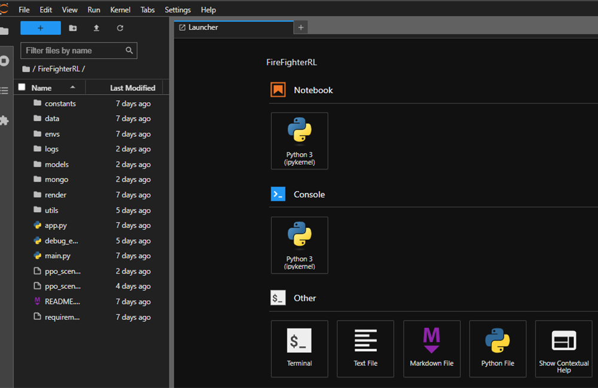
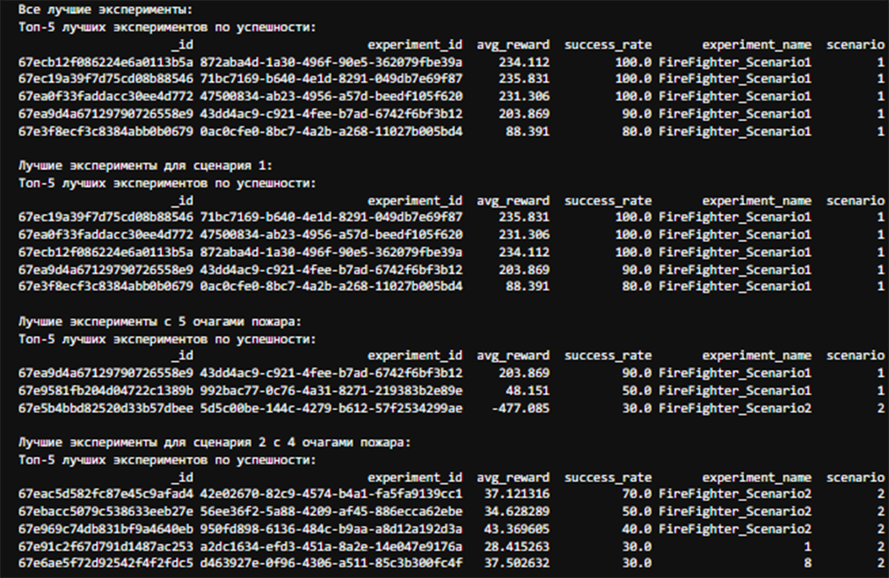
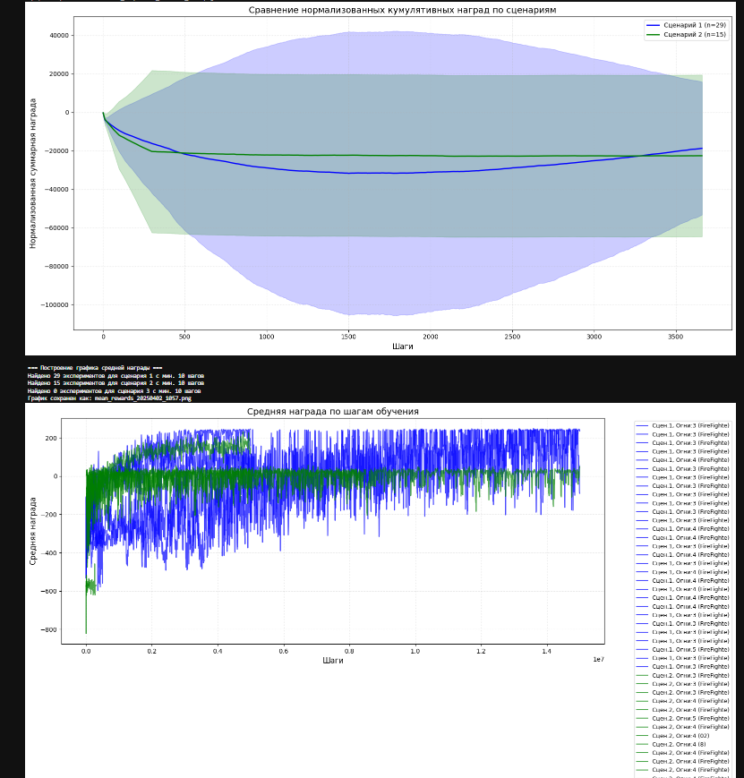
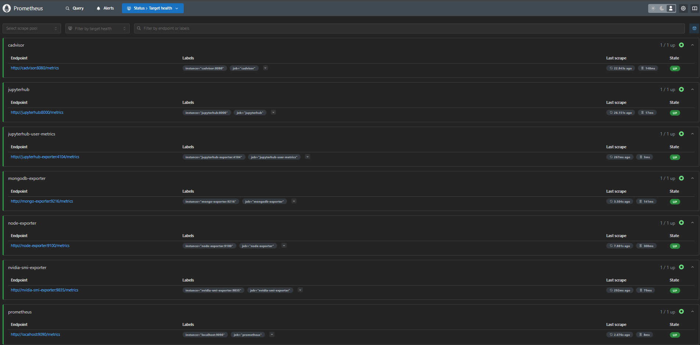
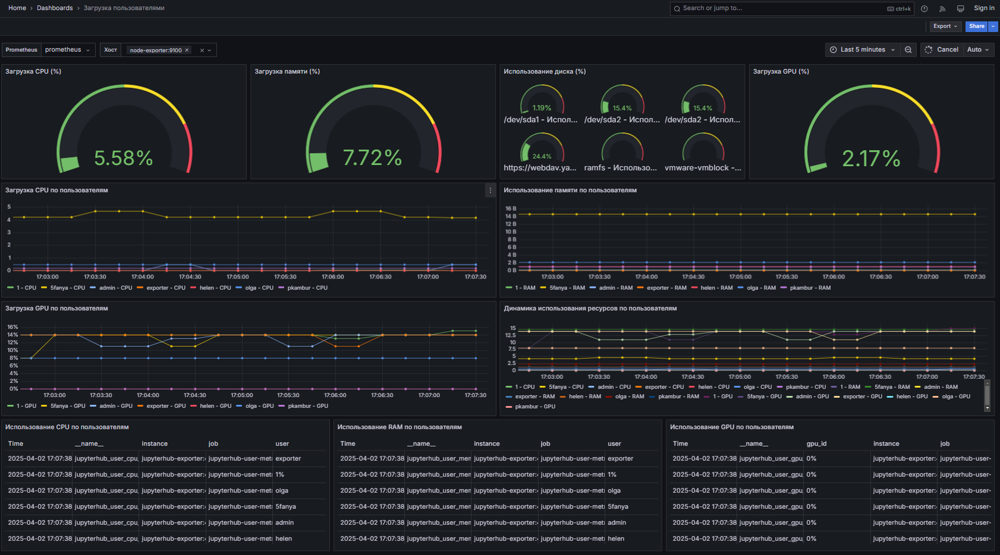

- [Описание проекта FireFighterRL](README.md)
- [Руководство по развертыванию FireFighter ML-инфраструктуры](firetechinstallguide.md)
- [Руководство по системе резервного копирования](backupinstallguide.md)

# Архитектура проекта FireFighter

## 📋 Содержание

- [Обзор инфраструктуры](#1-обзор-инфраструктуры)
- [Компоненты системы](#2-компоненты-системы)
  - [JupyterHub (Среда разработки)](#21-jupyterhub-среда-разработки)
  - [MongoDB (База данных)](#22-mongodb-база-данных)
  - [Система мониторинга](#23-система-мониторинга)
  - [Система резервного копирования](#24-система-резервного-копирования)
- [Сетевая структура](#3-сетевая-структура)
- [Доступность и порты](#4-доступность-и-порты)
- [Особенности для ML-проекта](#5-особенности-для-ml-проекта)
- [Безопасность](#6-безопасность)
- [Диаграмма архитектуры](#7-диаграмма-архитектуры)
- [Заключение](#8-заключение)

## 1. Обзор инфраструктуры

Проект построен на микросервисной архитектуре с использованием Docker-контейнеров, управляемых через Docker Compose. Основные компоненты инфраструктуры:

1. **Среда разработки (JupyterHub)**
2. **База данных (MongoDB)**
3. **Система мониторинга (Prometheus, Grafana)**
4. **Система резервного копирования**

- [Репозиторий проекта FireFighterRL](https://github.com/FireTech-team41/FireFighterRL/tree/main)
- [Руководство по развертыванию FireFighter ML-инфраструктуры](firetechinstallguide.md)
- [Руководство по системе резервного копирования](backupinstallguide.md)

## 2. Компоненты системы

### 2.1. JupyterHub (Среда разработки)

JupyterHub предоставляет изолированные рабочие окружения для пользователей проекта:

- **Контейнеризация**: Каждый пользователь получает собственный Docker-контейнер
- **Аутентификация**: Использует NativeAuthenticator для регистрации и управления пользователями
- **GPU-поддержка**: Настроен доступ к NVIDIA GPU из пользовательских контейнеров
- **Персистентность**: Данные пользователей сохраняются в Docker-томах

Конфигурация JupyterHub содержит следующие ключевые настройки:
- Timeout для неактивных сессий (1 час)
- Автоматическое отключение серверов при выходе пользователя
- Оптимизация TensorFlow для процессоров AMD с AVX2/FMA

Образ Jupyter Notebook содержит предустановленные библиотеки для:
- Reinforcement Learning (Gymnasium, Stable-Baselines3, Optuna)
- Deep Learning (PyTorch, TensorFlow с поддержкой GPU)
- Data Science и визуализации (NumPy, Pandas, Matplotlib, Plotly)
- Симуляционной среды (Pygame)

 

  
  
<em>Блокнот пользователя</em>

 

### 2.2. MongoDB (База данных)

Сервис MongoDB обеспечивает хранение данных проекта:

- **Постоянное хранение**: Данные базы сохраняются в комбинации Docker-томов и физической файловой системы (.database/)
- **Мониторинг**: Интегрированный mongodb_exporter для сбора метрик
- **Доступность**: Доступна из сети Jupyter и блокнотов пользователей

 

  
  
<em>Метрики сохраняемые в базе данных Mongo</em>

 

  
  
<em>Аналитика</em>

 

### 2.3. Система мониторинга

Комплексная система мониторинга обеспечивает наблюдение за всеми компонентами:

- **Prometheus**: Сбор и хранение метрик
  - node-exporter: Метрики хоста (CPU, память, диск, сеть)
  - nvidia-smi-exporter: Метрики GPU (использование, память)
  - cadvisor: Метрики контейнеров
  - jupyterhub-exporter: Кастомный экспортер метрик JupyterHub
  - mongo-exporter: Метрики MongoDB

   

  
  
<em>Экспорт метрик в Prometheus</em>

 

- **Grafana**: Визуализация и алертинг
  - Настроены дашборды для:
    - GPU мониторинга
    - Метрик сервера
    - Статистики пользователей JupyterHub
    - Мониторинга MongoDB
    - Загрузки ресурсов пользователями

     

  
  
<em>Дашборд в Grafana</em>

 

- **AlertManager**: Система оповещений по email

- **Loki**: Централизованный сбор логов
  - Собирает логи со всех контейнеров
  - Интегрирован с Grafana для визуализации

### 2.4. Система резервного копирования

Реализована автоматизированная система резервного копирования:

- **Локальное и удаленное хранение**: Копии сохраняются локально и загружаются на Yandex Disk
- **Инкрементальность**: Поддерживается сохранение только изменений
- **Шифрование**: Резервные копии шифруются
- **Ротация**: Автоматическое удаление устаревших копий

Основные компоненты для резервного копирования:
- JupyterHub (пользовательские данные)
- MongoDB (данные базы)
- Конфигурационные файлы

## 3. Сетевая структура

Сервисы организованы в две основные сети:

1. **jupyter-network**: Основная сеть для JupyterHub и MongoDB
   - Обеспечивает изоляцию пользовательских контейнеров
   - Обеспечивает доступ к MongoDB из JupyterHub

2. **monitoring**: Сеть для компонентов мониторинга
   - Позволяет Prometheus собирать метрики со всех сервисов
   - Обеспечивает доступ Grafana к Prometheus и Loki

## 4. Доступность и порты

Сервисы доступны через следующие порты:

- **JupyterHub**: внешний_ПОРТ, 8000 (внутренний)
- **Grafana**: внешний_ПОРТ, 3000 (внутренний)
- **Prometheus**: внешний_ПОРТ, 9090 (внутренний)
- **JupyterHub Exporter**: 4104 (внутренний)
- **MongoDB**: 27017 (внутренний)

## 5. Особенности для ML-проекта

Система спроектирована с учетом потребностей ML-проекта FireFighter:

- **GPU acceleration**: Все компоненты имеют доступ к GPU для ускорения обучения моделей
- **Resource monitoring**: Детальный мониторинг использования ресурсов (CPU, RAM, GPU) по пользователям
- **ML libraries**: Предустановленные библиотеки для Reinforcement Learning (RL) и Multi-Agent RL (MARL)
- **Simulation environment**: Подготовлена среда для симуляций с использованием Pygame и Gymnasium

## 6. Безопасность

Реализованы следующие меры безопасности:

- **Аутентификация**: Контроль доступа в JupyterHub через NativeAuthenticator
- **Изоляция**: Каждый пользователь работает в изолированном контейнере
- **Шифрование**: Резервные копии шифруются
- **Токены и пароли**: Используются для аутентификации сервисов

## 7. Диаграмма архитектуры

## 8. Заключение

Архитектура проекта FireFighter представляет собой хорошо структурированную и масштабируемую систему для разработки, обучения и тестирования ML-моделей с использованием технологий Reinforcement Learning и роевого интеллекта.

Ключевые преимущества реализации:
- Изоляция пользовательских окружений
- Полноценная поддержка GPU
- Детальный мониторинг всех компонентов
- Автоматизированные процессы резервного копирования
- Гибкость настройки и расширения

  <a href="#top">↑ Наверх</a>

